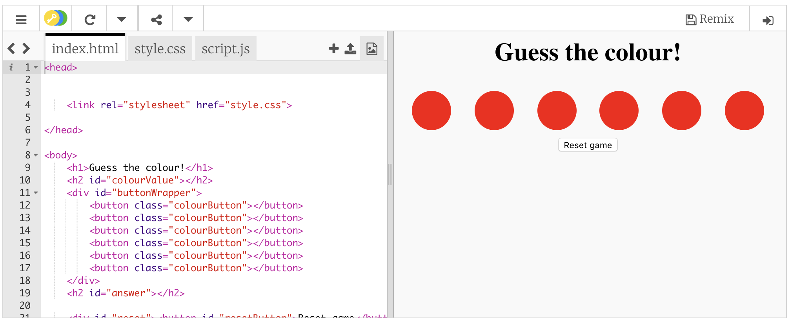

## Get started

Go to [dojo.soy/js-colours](http://dojo.soy/js-colours). You will see a box containing an example website project. On the right-hand side is a website, and on the left-hand side is the code that makes the website.



You don't have to have an account on Trinket to work on this project.

If you do have an account on Trinket, click the **Remix** button at the top right of the project \(If you are not signed in, you will be asked to do so. Once you are signed in, you need to click the **Remix** button again\). Doing this creates a copy of the project that you can work with. 


The button should say **remixed** after you click it.
  


--- collapse ---
---
title: How to use Trinket without an account
---

Even if you don't have an account on Trinket, you can still save your work. Go to the **Share** menu and click on one of the options to get a link, which you can save somewhere in a text document file, or share with to someone via email.

**Note: each time you make a change to your code, you get a new link!**

--- /collapse ---

--- collapse ---
---
title: How to create a free Trinket account
---

A Trinket account lets you:
1. Access your work easily from any computer
1. Save a copy of any project somebody shares with you so you can make your own changes to it

+ If you do not have an account, go to [dojo.soy/trinket](http://dojo.soy/trinket) and click on **Sign Up For Your Free Account**. You will need an email address to sign up. 

+ Enter your email address and choose a password, or ask somebody to do this for you.

+ You can now access all your saved or remixed projects by clicking on your username and then clicking on **My Trinkets**.


--- /collapse ---

The trinket contains three files:
 - `index.html`, which contains the HTML code for the web page on the right-hand side, where you will see the effect of your changes and additions. You **will not** need to change the HTML code itself.
 - `style.css`, which contains the CSS code that controls what the web page looks like. You **will not** need to change the CSS code either.
 - `script.js`, where you will create your JavaScript code.

### Using JavaScript to change a web page

JavaScript is present all over the internet — from Amazon to YouTube — because it is the best tool for making web pages respond to something the user does. This language can be used for things as simple as including a Twitter feed on a homepage, to things as advanced as building live chats and in-browser games.

All the JavaScript coders who build huge websites like Amazon and Youtube start by figuring out how to do one simple thing: choose an element of a web page, and change it. You're going to start in the same place.

The basic structure of a web page is in the HTML code. A web page is made up of **tags** (also called **elements**) that tell the browser what to include when building the page. Some of the HTML code for the web page you are working with (`index.html`) looks like this:

```HTML
<h1>Guess the colour!</h1>
<h2 id="colourValue"></h2>
<div id="buttonWrapper">
    <button class="colourButton"></button>
    <button class="colourButton"></button>    
    <button class="colourButton"></button>    
    <button class="colourButton"></button>    
    <button class="colourButton"></button>    
    <button class="colourButton"></button>    
</div>
<h2 id="answer"></h2>
```

The `<h1>` and `<h2>` tags create **headings**: they appear on the page as big, bold text. Try changing 'Guess the colour!' to something else to see how they work. The `<button>` tags create buttons! Here, the buttons are red circles.

You'll also see **attributes** in the tags. For example, `id`, which is a unique identifier for a tag, and `class`, with which you identify similar tags, such as `colourButtons`.

The first thing you need to do is choose an element of the web page using your JavaScript code in `script.js`. You will use the element several times in your code, so you need to store it in a **variable**. You can think of a variable as a box for storing things. It has a label (the variable's name) on the outside, and you can use that label to get the box and look at, or change, the thing in it.

--- task ---
Go to the `script.js` tab and add these lines of code to: 
 - Create a variable called `heading`
 - Select the element on the web page that has an `id` of `colourValue` (one of the headings has this `id`), and store the element in the `heading` variable

```JavaScript
var heading;
heading = document.getElementById('colourValue');
```
--- /task ---

Great! Now you can change this element of the web page in your JavaScript code. Try out how that works by making the element say hello!

--- task ---
Below the line of code that stores the element in the variable `heading`, add this line to change the contents of the element:

```JavaScript
heading.innerHTML = 'Hello world!';
```
--- /task ---
