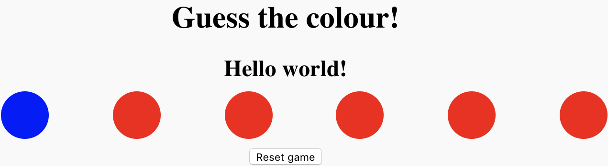

## Changing a button's colour
At the moment, all the buttons on the page are red. Since the whole game is based on having different coloured buttons, you're going to need a way to change a button's colour! 

Colours on computers are made up of three different values — for red, green, and blue — that are mixed together to form the 16777216 colours that a computer can display. Each value is between 0 and 255. For example, red is (255,0,0), green is (0,255,0) and blue is (0,0,255). Purple, as a mix of red and blue, is (255,0,255). White is all three colours at full brightness (255,255,255) and black is all three at zero brightness (0,0,0). So what you need to be able to do is take those three numbers and tell the button you want to change to use them as its background colour.

Because you will need to do this a few times, you want to teach JavaScript to do most of the work for you, using a **function**.

--- task ---
Your function needs to be able to:

 - Take a button
 - Take a value for each of red, green, and blue
 - Use those values to make a colour
 - Assign that colour as the background colour of the button

The actual colour change is done by changing the **CSS** style rule for the button.

Add this code to your `script.js` file.
```JavaScript
function setButtonColour(button, red, green, blue){
    button.setAttribute('style',
                        'background-color: rgb('+ red +','+ green +','+ blue +');'
                       );
}
```
--- /task ---

--- collapse ---
---
title: What is a function?
---
Code is normally made up of functions — sets of instructions joined together with a name. Think of something like making a cup of tea as a function: 

  1. Get kettle
  2. Put water in kettle
  3. Boil water
  4. Get teapot
  5. Put teabag in teapot
  6. Put water in teapot
  7. Wait...
  8. Get cup
  9. Pour tea into cup
  
That's a lot of steps! Imagine having to tell someone to do each of them every time you wanted them to make tea! It's much easier to teach someone how to make a cup of tea once and then just ask them to 'make tea' in future! It's the same with code: We can use functions to do complex things with simple commands.

--- /collapse ---

Now, before you can use your function, you need a button to point it to! All the `button` tags in the HTML file you started with have been given the `class` 'colourButton'. You can use this to select them as a group and then choose one to test your function on.

--- task ---
At the start of your `script.js` file, add this line to get all the buttons and store them in a variable called `buttons`:

```JavaScript
var buttons = document.getElementsByClassName('colourButton');
```
--- /task ---

What you've got is called an **array**: a variable that's a list of things, in this case anything with the class `colourButton` on the page. You can read what's in any position of the arry using square brackets `[]` and the position of the item you're looking for. Since JavaScript starts counting from zero, you can get the first item in the array like this:

```JavaScript
buttons[0]
```

--- task ---
Below where you created your `buttons` variable, add this line of code that takes the first button and changes the colour to blue using your `setButtonColour` function:

```JavaScript
setButtonColour(buttons[0], 0, 0, 255);
```
--- /task ---

Now watch as your button changes colour! If you're working offline you'll need to reload the page in your browser to make this happen.

