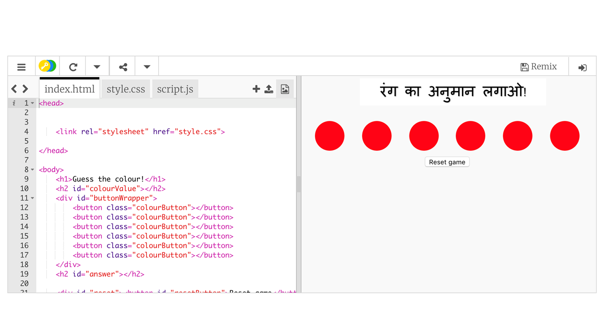
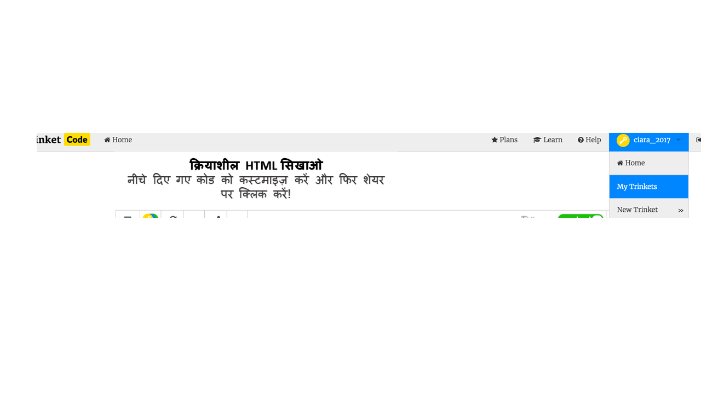

## शुरू करें

[dojo.soy/js-colours](http://dojo.soy/js-colours) पर जाएं। आपको एक बॉक्स में एक उदाहरण वेबसाइट प्रोजैक्ट दिखाई देगा । वहाँ दाईं ओर वेबसाइट है, और बाईं ओर वह कोड है जो वेबसाइट बनाता है।



इस प्रोजैक्ट में काम करने के लिए आपके पास Trinket पर खाता होना ज़रूरी नहीं है।

यदि आपका Trinket पर खाता है, तो प्रोजेक्ट के शीर्ष दाईं ओर **रीमिक्स** बटन पर क्लिक करें (यदि आप साइन इन नहीं हैं, तो आपको ऐसा करने के लिए कहा जाएगा। साइन इन करने के बाद, आपको फिर **रीमिक्स** बटन दबाना होगा)| ऐसा करने से उस प्रोजेक्ट की कॉपी बन जाती है जिस पर आप काम कर सकते हैं।


क्लिक करने के बाद बटन पर **remixed** लिखा होना चाहिए.


--- collapse ---
---
title: बिना किसी खाते के ट्रिंकेट का उपयोग कैसे करें
---

भले ही आपके पास ट्रिंकेट पर कोई खाता नहीं है, तो भी आप अपना काम सहेज सकते हैं। **शेयर** मेनू पर जाएं और लिंक पाने के लिए किसी एक विकल्प पर क्लिक करें, जिसे आप टेक्स्ट डॉक्यूमेंट फाइल में कहीं सेव कर सकते हैं, या ईमेल के जरिए किसी से शेयर कर सकते हैं।

**ध्यान दें: हर बार जब आप कोड में कोई बदलाव करते हैं, तो आपको एक नया लिंक मिलेगा।**

--- /collapse ---

--- collapse ---
---
title: नि शुल्क ट्रिंकेट खाता कैसे बनाए
---

एक ट्रिंकेट खाता आपको:
1. किसी भी कंप्यूटर से अपने काम को आसानी से एक्सेस करने
1. आपके साथ किसी का शेयर किया हुआ फाईल सेव करनें देता है ताकि आप उसमें अपने अनुसार बदलाव कर सकें

+ यदि आपके पास कोई खाता नहीं है, तो [dojo.soy/trinket](http://dojo.soy/trinket) पर जाएं और **Sign up for your Free account**पर क्लिक करें। साइन अप करने के लिए आपको एक ईमेल एड्रेस की आवश्यकता होगी।

+ अपना ईमेल एड्रेस दर्ज करें और एक पासवर्ड चुनें या यह करने में किसी की सहायता ले।

+ अब आप अपने username पर क्लिक करके अपनी सभी सहेजी गई या रीमिक्स की गई प्रोजैक्ट को**माय ट्रिंकेट्स** पर जाकर देख सकते हैं।



--- /collapse ---

ट्रिंकेट में तीन फ़ाइल हैं:
 - `index.html`, जिसमें दाईं ओर वेब पृष्ठ के लिए HTML कोड होता है, जहां आप अपने परिवर्तनों और परिवर्धन का प्रभाव देखेंगे। आपको HTML कोड को स्वयं बदलने की ज़रूरत **नहीं होगी**।
 - `style.css`, जिसमें सीएसएस कोड होता है जो नियंत्रित करता है वेब पृष्ठ कैसा दिखेगा। आपको सीएसएस कोड को बदलने की ज़रूरत **नहीं होगी**।
 - `script.js` , जहाँ आप अपना JavaScriptकोड बनाएँगे।

### वेब पृष्ठ बदलने के लिए JavaScript का उपयोग

JavaScript पूरे इंटरनेट पर मौजूद है - Amazon से YouTube तक - क्योंकि यह वेब पृष्ठ को उपयोगकर्ता के कुछ करने पर प्रतिक्रिया देने के लिए सबसे अच्छा उपकरण है। इस भाषा का उपयोग साधारण चीज़ों के लिए किया जा सकता है, जैसे कि मुखपृष्ठ पर ट्विटर फ़ीड सहित, लाइव चैट और ब्राउज़र गेम के निर्माण के लिए उन्नत चीजों के लिए।

सभी JavaScript कोडर्स जो Amazon और Youtube जैसी विशाल वेबसाइट बनाते हैं, वे शुरुआत एक वेब पेज का एक तत्व चुननें, और इसे बदलने: जैसे एक साधारण काम को किस तरह करना है यह पता लगाकर करते है आप उसी स्थान पर शुरू करेंगे।

एक वेब पृष्ठ की मूल संरचना HTML कोड में है। एक वेब पृष्ठ**टैग** से बना है(जिसे **तत्व** भी कहा जाता है) जो ब्राउज़र को बताता है कि पेज बनाते समय क्या शामिल करना है। आपके द्वारा काम किए जा रहे वेब पृष्ठ के कुछ HTML कोड (`index.html`) इस तरह दिखते है:

```HTML
<h1>Guess the colour!</h1>
<h2 id="colourValue"></h2>
<div id="buttonWrapper">
    <button class="colourButton"></button>
    <button class="colourButton"></button>    
    <button class="colourButton"></button>    
    <button class="colourButton"></button>    
    <button class="colourButton"></button>    
    <button class="colourButton"></button>    
</div>
<h2 id="answer"></h2>
```

`<h1>` और `<h2>` टैग **शीर्षक** बनाते हैं: वे पृष्ठ पर बड़े, बोल्ड टेक्स्ट के रूप में दिखाई देते हैं। यह देखने के लिए कि वे कैसे काम करते हैं 'Guess the colour!' को किसी और चीज़ में बदले। `<button>` टैग बटन बनाते हैं! यहाँ, बटन लाल वृत्त हैं।

आप **attributes**भी टैग में देखेंगे । उदाहरण के लिए, `id`, जो एक टैग के लिए एक अनोखा पहचानकर्ता है, और `class`, जिसके साथ आप इसी तरह के टैग की पहचान करते हैं, जैसे `colourButtons` ।

पहली चीज जो आपको करने की ज़रूरत है वह है `script.js` में अपने JavaScript कोड का उपयोग करके वेब पृष्ठ का एक तत्व चुनना । आप अपने कोड में कई बार तत्व का उपयोग करेंगे, इसलिए आपको इसे **वेरिएबल** में संग्रहीत करने की ज़रूरत है । आप वेरिएबल को चीजों को सेव करने के लिए एक बॉक्स के रूप में सोच सकते हैं। इसके बाहर की तरफ एक लेबल (वेरिएबल का नाम) है, और आप उस लेबल का उपयोग बॉक्स प्राप्त करने और देखने, या उसमें मौजूद चीज़ को बदलने के लिए कर सकते हैं।

--- task ---

`script.js `टैब पर जाएं और कोड की इन पंक्तियों को इसमें जोड़ें:
 - एक `शीर्षक` नाम से वैरिएबल बनाएं
 - उस वेब पेज पर तत्व का चयन करें जिसमें `colourValue` की `id` है (शीर्षकों में से एक में यह `id` है), और `heading` वेरिएबल में तत्व को सेव करें

```JavaScript
var heading;
heading = document.getElementById('colourValue');
```
--- /task ---

शानदार! अब आप वेब पृष्ठ के इस तत्व को अपने JavaScript कोड में बदल सकते हैं। वह कैसे काम करता है यह तत्व से नमस्ते कहलवाकर देखें!

--- task ---

कोड की पंक्ति के नीचे जो वेरियबल `शीर्षक` में तत्व को संग्रहीत करता है, तत्व की सामग्री को बदलने के लिए इस लाइन को जोड़ें:

```JavaScript
heading.innerHTML = 'Hello world!';
```
--- /task ---
