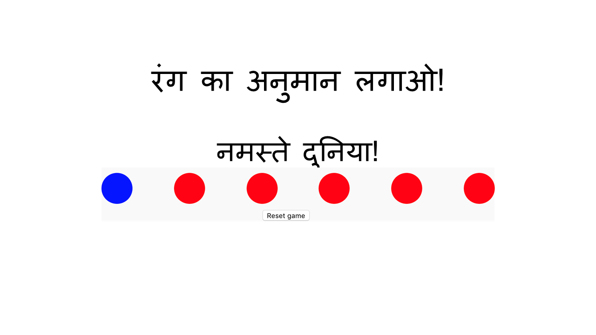

## एक बटन का रंग बदलें

फिलहाल, वेब पृष्ठ के सभी बटन लाल हैं। पूरा खेल अलग-अलग रंग के बटन रखने पर आधारित है, इसलिए आपको एक बटन के रंग को बदलने का एक तरीका चाहिए!

कंप्यूटर प्रोग्राम में रंग तीन अलग-अलग वैल्युज़ से बने होते हैं: R, G, और B, लाल, हरे और नीले रंग के लिए। प्रत्येक मान 0 और 255 के बीच है, और एक साथ, ये तीन मान 16777216 रंगों को परिभाषित करते हैं जो एक कंप्यूटर प्रदर्शित कर सकता है।

उदाहरण के लिए:
- लाल है (255, 0, 0)
- हरा है (0, 255, 0)
- नीला है (0, 0, 255)
- बैंगनी, जो लाल और नीले रंग का मिश्रण है, (255, 0, 255)
- सफ़ेद तीन रंग की पूर्ण चमक का मान है (255, 255, 255)
- ब्लैक सभी तीन मूल्य की शून्य चमक पर हैं (0, 0, 0)

तो एक बटन के रंग को बदलने के लिए, आप बटन को 0 और 255 के बीच के तीन मानों को इसके पृष्ठभूमि रंग के रूप में उपयोग करने के लिए कहते हैं।

क्योंकि आपको अपने गेम के कोड में कुछ बार ऐसा करने की आवश्यकता है, इसलिये आप एक ** फ़ंक्शन**लिखेंगे ताकि आपका JavaScript प्रोग्राम आपके लिए ज्यादातर काम कर सके।

--- collapse ---
---
title: फंक्शन क्या है?
---

कोड अक्सर फंक्शन से बना होता है, जो एक नाम के साथ जुड़ने वाले निर्देशों के सेट होते हैं। फंक्शन उपयोगी क्यों हैं? एक कप चाय बनाने में शामिल सभी चरणों के बारे में सोचें:

  1. केतली प्राप्त करें
  2. केतली में पानी डालें
  3. पानी उबालें
  4. चायदानी लें
  5. चायपत्ती को चायदानी में डालें
  6. चायदानी में पानी डालें
  7. प्रतीक्षा करें
  8. कप लें
  9. चाय को कप में डालें

यह बहुत सारे कदम है! हर बार जब आप किसी को एक कप चाय बनाने के लिए कहते, तो उन्हें यह बताना उबाऊ होगा। किसी को एक बार एक कप चाय बनाना सिखाना और उसके बाद अगली बार उन्हें सिर्फ 'चाय बनाने' के लिए कहना बहुत आसान है ।

कोडिंग के साथ इसी तरह है: आप साधारण कमांड के साथ जटिल चीजें करने के लिए फ़ंक्शन बनाते हैं।

--- /collapse ---

--- task ---

आपके फंक्शन को आवश्यकता है:

 - एक बटन लें
 - लाल, हरे और नीले रंग के लिए तीन वैल्युज़ लें
 - रंग बनाने के लिए उन वैल्युज़ का उपयोग करें
 - उस रंग को बटन के बैकग्राउंड कलर के रूप में असाइन करें

इस कोड को अपने ` script.js` फ़ाइल में जोड़ें ` setButtonColour ` नाम का उपयोग इस फ़ंक्शन को बनाने के लिए करें।

```JavaScript
function setButtonColour(button, red, green, blue){
    button.setAttribute('style',
                        'background-color: rgb('+ red +','+ green +','+ blue +');'
                       );
}
```

रंग बदलने के लिए कोड, ** CSS style rule** को बटन के लिए बदल देता है ।

--- /task ---

अपने फ़ंक्शन का उपयोग करने के लिए, आपको इसे एक बटन पर संकेत करना होगा।

HTML फ़ाइल में सभी ` बटन `टैग्स की ` class` ` colourButton ` है । यह `class` आपको एक समूह के रूप में सभी बटन का चयन करने देता है और फिर अपने फ़ंक्शन के परीक्षण के लिए एक चुनता है।

--- task ---

आपके ` script.js ` फ़ाइल के शीर्ष पर, कोड की इस लाइन को ` बटन` नामक एक वेरियबल में सभी बटनों को संग्रहीत करने के लिए जोड़ें:

```JavaScript
var buttons = document.getElementsByClassName('colourButton');
```

--- /task ---

` बटन ` ` शीर्षक`, जैसे एक नियमित वेरिएबल नहीं है यह एक **array** है । एक array चीजों की एक सूची है। ` बटन ` array में ` colourButton `नाम के` class` के साथ कुछ भी मौजूद है।

आप वर्ग कोष्ठक ` []` से घिरे स्थान संख्या का उपयोग करके किसी array के किसी भी स्थान पर क्या है पढ़ सकते हैं । चूंकि JavaScript शून्य से गिनना शुरू करती है, आपको array में पहला आइटम इस तरह से मिलता है:

```JavaScript
buttons[0]
```

--- task ---

नीचे जहाँ आपने अपने ` बटन ` array बनाए हैं, कोड की इस पंक्ति को जोड़ते हैं, जो array में पहला बटन लेती है और आपके ` setButtonColour ` फंक्शन का उपयोग करके बटन का रंग बदलकर नीला कर देती है:

```JavaScript
setButtonColour(buttons[0], 0, 0, 255);
```
--- /task ---

अब अपना बटन को रंग बदलते देखें! यदि आप ऑफ़लाइन काम कर रहे हैं, तो आपको परिवर्तन देखने के लिए अपने ब्राउज़र में पृष्ठ को फिर से लोड करना होगा।


