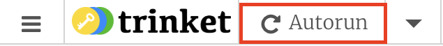

## अनोखे रंग

अब आप एक बटन का चयन कर सकते हैं और उसका रंग बदल सकते हैं जो आप चाहते हैं! लेकिन अपने खेल को काम करने के लिए, आपको अनोखे रंगों की आवश्यकता होती है। यह आसान है, क्योंकि JavaScript आपके लिए अनोखी संख्या चुन सकता है, और आप यह सुनिश्चित कर सकते हैं कि वे ` 0 ` और ` 255 `के बीच हैं ।

अपने प्रोग्राम में ऐसा करने का सबसे अच्छा तरीका एक और फ़ंक्शन लिखना है जो अनोखे रंग मान (` 0 ` और ` 255 ` के बीच की संख्या) बनाता है और यह** रिटर्न ** करता है। जब कोई फ़ंक्शन वैल्यू लौटाता है, तो आप वैल्यू को बाद के लिए संग्रहीत कर सकते हैं या तुरंत उपयोग कर सकते हैं।

--- task ---

` makeColourValue` नामक फ़ंक्शन बनाने के लिए निम्न कोड का उपयोग करें जो JavaScript के अंतर्निहित ` Math.random ` और ` Math.round ` फंक्शन का उपयोग` 0 ` और ` 255 `, के बीच एक यादृच्छिक संख्या उत्पन्न करने के लिए करता है और फिर यह वैल्यू लौटाता है।

```JavaScript
function makeColourValue(){
    return Math.round(Math.random()*255);
}
```

--- /task ---

--- collapse ---
---
title: JavaScript और अनोखी संख्या
---

Javascript में एक अंतर्निहित फ़ंक्शन है जिसे ` Math.random `कहा जाता है जो ` 0 ` और ` 1 `के बीच एक अनोखी दशमलव संख्या पैदा करता है । इस संख्या को गुणा करके, आप ` 0` और कोई अन्य संख्या के बीच एक अनोखी संख्या प्राप्त कर सकते हैं । उदाहरण के लिए, ` 0` और ` 100 ` के बीच एक संख्या प्राप्त करने के लिए, आप ` Math.random ` का परिणाम ` 100` द्वारा गुणा करें, इस तरह:

```JavaScript
myRandomNumber = Math.random()*100;
```

यह काम करता है क्योंकि सबसे छोटी अनोखी संख्या ` Math.random ` बना सकते हैं ` 0 `, और ` 0 * 100 = 0 ` । सबसे बड़ी अनोखी संख्या है` 1 `, और ` 1 * 100 = 100 ` । और बीच में किसी भी अनोखी संख्या के साथ, आपको ` 0 ` और ` 100 ` के बीच एक संख्या मिलती है । उदाहरण के लिए, ` 0.25 * 100 = 25 ` ।

` math.random ` एक ** दशमलव** संख्या पैदा करता है, उदाहरण के लिए ` 0.245834 ` । अपने खेल के लिए, आप केवल पूरे नंबर (पूर्णांक) चाहते हैं, क्योंकि केवल वे ही रंग वैल्यू के रूप में काम करते हैं। इसलिए आपको ` Math.random` के परिणाम को गोल करना होगा । सौभाग्य से, JavaScript में एक अंतर्निहित फ़ंक्शन है जिसे ` Math.round`  कहा जाता है दशमलव संख्या को गोल करने में आपकी सहायता करने के लिए। तो ` 0 ` और ` 100 ` के बीच एक पूरी संख्या प्राप्त करने के लिए, आप लिखेंगे:

```JavaScript
myRandomNumber = Math.round(Math.random()*100);
```

--- /collapse ---

अब इस नए फ़ंक्शन का उपयोग करने का समय है।

--- task ---

तीन वेरिएबल बनाएं, जिसका नाम ` लाल`, ` हरा `, और ` नीला ` है, आपके ` makeColourValue` फंक्शन के द्वारा चुने हुए अनोखी रंग के साथ । फिर बटन को सेट करने वाले कोड को अपडेट करें ताकि वह बटन के रंग को सेट करने के लिए इन तीन वेरिएबल का उपयोग करे।

```JavaScript
var red = makeColourValue();
var green = makeColourValue();
var blue = makeColourValue();

setButtonColour(buttons[0], red, green, blue);
```

--- /task ---

अब वेब पेज को कुछ बार फिर से लोड करें और हर बार बटन को कलर बदलते देखें! यदि आप ऑनलाइन काम कर रहे हैं, तो पृष्ठ को ** ऑटोरन ** बटन पर क्लिक करके पुनः लोड करें, और यदि आप ऑफ़लाइन काम कर रहे हैं, तो अपने ब्राउज़र को ताज़ा करके पृष्ठ को पुनः लोड करें।


