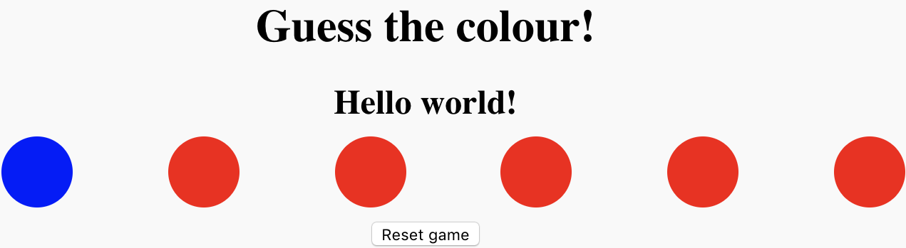

## सभी बटन बदलें

अब एक बटन अनोखे रूप से रंग बदल रहा है, लेकिन आप सभी छह बटन बदलना चाहते हैं। सौभाग्य से, आपको अपना कोड छह बार लिखने की ज़रूरत नहीं है, क्योंकि आप ** लूप ** का उपयोग कर सकते हैं !

एक `for` लूप किसी चीज़ को विशेष संख्या बार करता है। आप अपना लूप लिखेंगे ताकि यह प्रत्येक बटन को ` बटन `array में एक अनोखे रंग असाइन करे, आपको इस बात की चिंता किए बिना कि कितने बटन हैं। इसका मतलब है कि आप एक और तीन बटन, या एक और हजार जोड़ सकते हैं, और आपको कोड बदलने की आवश्यकता नहीं होगी!

--- task ---

एक बटन के रंग को बदलने वाले कोड के चारों ओर `for` लूप रखो । ** लूप वेरिएबल ** ` i ` का उपयोग` बटन ` array बदलने के लिए के किस तत्व को चुनना है यह करने के लिए।

```JavaScript
for (var i = 0; i < buttons.length; i++) {

  var red = makeColourValue();
  var green = makeColourValue();
  var blue = makeColourValue();

  setButtonColour(buttons[i], red, green, blue);

}
```

--- /task ---

पृष्ठ को कुछ समय के लिए पुनः लोड करें और सभी बटन को रंग बदलते देखें।



लूप बटन के रंगों को एक-एक करके बदलता है - हर बार लूप के चलने पर एक परिवर्तन होता है। लेकिन आप वास्तव में रंगों को एक-एक करके नहीं देख सकते, क्योंकि लूप बहुत तेज चलता है!

--- collapse ---
---
title: for लूप कैसे काम करता है
---

एक</code>for</0> में हमेशा चार भाग होते हैं:

1. लूप वेरिएबल (आमतौर पर ` i`कहा जाता है क्योंकि यह एक ** i ** nteger है)। आपके कोड में, यह वेरिएबल ` var i = 0; ` लूप कोड का टुकड़े के साथ बनाया जाता है । लूप वेरिएबल का उपयोग लूप चलाने के समय की संख्या को गिनने के लिए किया जाता है, और यह निर्धारित करने के लिए कि लूप कुल कितनी बार चलता है।
1. परीक्षण, जो यह तय करता है कि लूप ब्रैकेट के अंदर कोड चलाना है या नहीं ` {} ` । परीक्षण एक ** स्थिति** की जाँच करता है, उदाहरण के लिए, 'लूप वेरिएबल 5 है या बड़ा है?'। यदि परीक्षण सफल होता है, तो लूप के अंदर कोड चलता है, और फिर प्रोग्राम फिर से परीक्षण के लिए वापस आता है। यदि परीक्षण सफल नहीं होता है, तो शेष सभी लूप को छोड़ दिया जाता है और प्रोग्राम जारी रहता है। आपके लूप में, परीक्षण पूछता है 'क्या लूप वेरिएबल ` बटन ` array में आइटम की संख्या से छोटा है? '। यह ` i <buttons.length ` लूप कोड का हिस्सा, जहां ` buttons.length ` गुण बताती है कि कितने आइटम ` बटन` में हैं ।
1. वास्तविक कोड जो लूप चलाता है, कोष्ठक  ` {} ` के अंदर समाहित होता है । यह कोड कुछ भी हो सकता है जिसे आप चाहते हैं, और इसमें लूप वेरिएबल के वर्तमान वैल्यू तक पहुंच है। लूप वेरिएबल का उपयोग करते हुए, आपका लूप '` बटन` array पर लूप करता है, इसलिए हर बार जब यह चलता है, तो यह array में एक अलग बटन पर एक क्रिया करता है।
1. कोड का एक छोटा टुकड़ा जो एक बार लूप के एक बार चलने पर चलता है। JavaScript में `for` लूप्स, कोड का यह टुकड़ा लूप के शीर्ष पर होता है, अंतिम टुकड़ा ` () ` कोष्ठकों के अंदर होता है। अधिकतर, कोड का यह टुकड़ा केवल ` 1`को लूप वेरिएबल में जोड़ता है लूप की प्रगति को चिह्नित करने के लिए । यह वही है जो आपके लूप में कोड का टुकड़ा करता है: ` i ++ ` ` i = i + 1 ` के लिए एक छोटा संस्करण है।

--- /collapse ---
