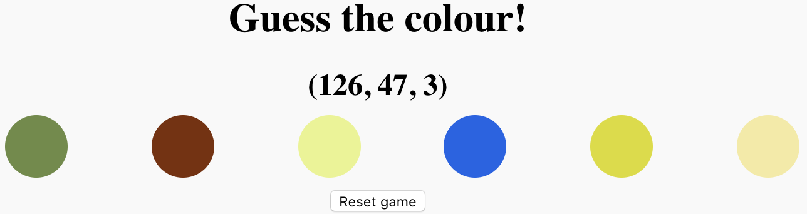

## जवाब चुनें और उसकी जाँच करें

आपका खेल अब हर बार रिलोड होने पर अनोखे रंग चुनता है। अगला, आपको जीतने वाले उत्तर होने के लिए एक रंग चुनने की आवश्यकता है और इसे ऐसा करें कि, जब खिलाड़ी सही बटन पर क्लिक करे, तो उन्हें बताया जाए कि वे जीत गए हैं।

ऐसा करने के लिए आपको निम्न करने की आवश्यकता है:

 - सही उत्तर के रूप में अनोखे रंगों में से एक चुनें
 - खिलाड़ी को उस रंग के RGB रंग वैल्यू प्रदर्शित करें
 - सुनिश्चित करें कि जब खिलाड़ी विजेता बटन पर क्लिक करता है, तो एक संदेश उन्हें बताता है कि वे जीत गए हैं

सबसे आसान तरीका है कि पहले दो चीजें करें, एक random __बटन__ चुनें सही उत्तर के रूप में, और इसके रंग वैल्युज़ को प्रदर्शित करने के लिए।

सबसे पहले, एक बटन चुनें।

--- task ---

आप पहले से ही जानते हैं कि किसी नंबर को अनोखे में कैसे चुना जाता है, इसलिए अब एक ऐसा नंबर चुनें जो किसी आइटम की स्थिति का वर्णन करता है `बटन` array में।

इस कोड को अपने `for`लूप के ठीक ऊपर जोड़ें:

```JavaScript
var answerButton = Math.round(Math.random() * (buttons.length - 1));
```

यह पंक्ति `answerButton` नामक एक वेरिएबल बनाती है वह अनोखे संख्या संग्रहीत करता है।

--- /task ---

इसके बाद, आपको उस बटन के RGB रंग वैल्युज़ को प्रदर्शित करना होगा।

ये तीन मान `for` लूप में बनाए गए हैं जो बटन के रंग को सेट करता है, ताकि वैल्युज़ को प्रदर्शित करने के लिए अपना कोड प्राप्त करने का सही समय हो। और आपको यह सुनिश्चित करने की आवश्यकता है कि रंग वैल्यु केवल प्रदर्शित हो अगर बटन `for` लूप `बटन` array में `answerButton` पोजिशन पर लूपिंग कर रहा है। ऐसा करने के लिए, आप **`if` statement** का उपयोग करते हैं ।

एक `if` statement एक बिट कोड है जो एक विशेष स्थिति का परीक्षण करता है, और यदि परीक्षण सफल होता है, तो कोड `if` के अंदर statement चलता है। जैसे `for` लूप में, `if`कथन के अंदर कोड ब्रेसिज़ में है (`{}`) condition के बाद।

--- task ---

सबसे पहले, आपके द्वारा अपने हैलो संदेश के साथ वेब पेज शीर्षक को अपडेट करने के लिए पहले लिखी गई कोड की लाइन को **delete**करें। आपको शीर्षक में रंग वैल्यू प्रदर्शित करने की आवश्यकता है!

--- /task ---

--- task ---

फिर अपने `for` लूप अपडेट करें `if` statement जोड़ने के लिए जो चेक करता है की अगर लूप `answerButton`के साथ काम कर रहा है । यदि हाँ, तो `if` पेज शीर्षक के रूप में स्टेटमेंट को रंग वैल्यू प्रदर्शित करना चाहिए।

यह ऐसा दिखाई देना चाहिए:

```JavaScript
for (var i = 0; i < buttons.length; i++) {

  var red = makeColourValue();
  var green = makeColourValue();
  var blue = makeColourValue();

  setButtonColour(buttons[i], red, green, blue);

  if (i === answerButton) {
    heading.innerHTML = `(${red}, ${green}, ${blue})`;
  }
}
```

ध्यान दें कि आप `${red}` उपयोग कर सकते हैं`लाल`वेरिएबल के वैल्यू को स्ट्रिंग के अंदर शामिल करने के लिए और वही अन्य रंग वैल्यू वेरिएबल के लिए सच है।

--- /task ---

अब आपको कोड जोड़ने की आवश्यकता है ताकि आपका खेल जानता हो कि कौन सा बटन क्लिक करता है और प्रतिक्रिया में संदेश प्रदर्शित करता है।

पहली बात यह है कि वेब पृष्ठ पर तत्व का चयन करना है जहां संदेश दिखाई देगा।

--- task ---

अपने `for` लूप के ऊपर, एक वैरिएबल बनाएं जिसका नाम `answerMessage` है वेब पेज पर तत्व को संग्रहीत करने के लिए जिसकी `id` `answer`है (शीर्षकों में से एक में यह `id` है)। इस कोड का उपयोग यह करने के लिए करें:

```JavaScript
var answerMessage = document.getElementById('answer');
```

--- /task ---

अगला, प्रत्येक बटन को एक ** ईवेंट श्रोता** की आवश्यकता होती है । इवेंट श्रोता कोड के टुकड़े हैं जो आपके गेम को एक खिलाड़ी द्वारा की जाने वाली कार्रवाई की प्रतीक्षा करते हैं और फिर प्रतिक्रिया में कुछ करते हैं। आप चाहते हैं कि आपका गेम यह पता करे कि क्या खिलाड़ी एक बटन पर क्लिक करता है, इसलिए आपको जिन इवेंट श्रोताओं की आवश्यकता है, वे क्लिक का इंतजार करने वाले हैं।

--- task ---

`for`लूप के अंदर, प्रत्येक बटन पर क्लिक के लिए एक श्रोता जोड़ने के लिए, और एक क्लिक होने पर चलने के लिए श्रोता को एक फ़ंक्शन देने के लिए निम्न कोड डालें।

फंक्शन में कुछ चीजें शामिल हैं:
 - एक `if` statement, जिसे आप पहले से ही समझते हैं, हालांकि इस कथन में `else` हिस्सा शामिल है जो केवल तभी चलता है जब हालत का परीक्षण असफल हो
 - `innerHTML` `answerMessage` में संग्रहीत वेब पेज तत्व के पाठ को अद्यतन करता है
 - विशेष `this` कीवर्ड, जिसका अर्थ है, इस मामले में, 'बटन पर क्लिक किया गया'

```JavaScript
buttons[i].addEventListener('click', function(){
        if (this === buttons[answerButton]) {
            answerMessage.innerHTML = "Correct!";
        } else {
            answerMessage.innerHTML = "Wrong answer! Guess again!";
        }
    });
```

--- /task ---

--- collapse ---
---
title: आपका कोड ऐसा दिखना चाहिए:
---

निम्नलिखित कोड को देखें कि कैसे सब कुछ `script.js`में है, कार्यक्रम एक साथ फिट बैठता है:

```JavaScript
function makeColourValue() {
  return Math.round(Math.random() * 255);
}

function setButtonColour(button, red, green, blue) {
  button.setAttribute('style',
    'background-color: rgb(' + red + ',' + green + ',' + blue + ');'
  );
}


var buttons = document.getElementsByClassName('colourButton');

var heading = document.getElementById('colourValue');

var answerMessage = document.getElementById('answer');

var answerButton = Math.round(Math.random() * (buttons.length - 1));


for (var i = 0; i < buttons.length; i++) {

var red = makeColourValue();
var green = makeColourValue();
var blue = makeColourValue();

setButtonColour(buttons[i], red, green, blue);

if (i === answerButton) {
    heading.innerHTML =`(${red}, ${green}, ${blue})`;
}

buttons[i].addEventListener('click', function(){
    if (this === buttons[answerButton]) {
        answerMessage.innerHTML = "Correct!";
    } else {
        answerMessage.innerHTML = "Wrong answer! Guess again!";
    }
});

}
```


आपका कोड इस प्रकार दिखना चाहिए:



--- /collapse ---

वेब पेज को पुनः लोड करें और अपना गेम खेलें! फिलहाल, आपको हर बार नया राउंड खेलना चाहते हुए पृष्ठ को फिर से लोड करना होगा।